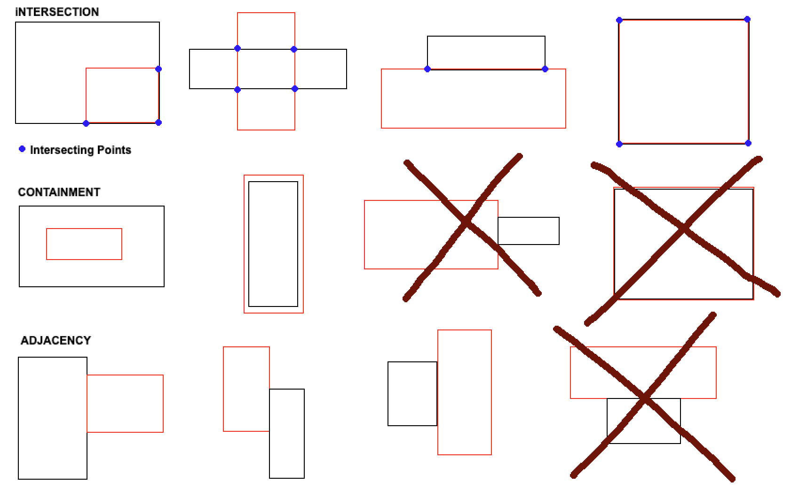

# nuvalence_rectangle
nuvalent_rectangle application analyzes client-input rectangles and detects intersection, containment, and adjacency. 

## Table of Contents

1. [Definiton](#defintion)
2. [Requirements](#requirements)
3. [Installation & Setup](#setup)
4. [DevDependencies](#dev)

## Definition <a name="definiton"></a>

| Feature | Description |
| --- | --- |
| Intersection | A point where a line from one rectangle meets or crosses a line from another rectangle |
| Containment | A rectangle wholly contains another rectangle and do not have any intersecting points |
| Adjacency | A rectangle shares its right or left side with another rectangle and one does not contain nor cross the other |



## Requirements <a name="requirements"></a>
You will need [Node.js](https://nodejs.org/en/) installed on your system.

## Installation & Setup <a name="setup"></a>


Open the terminal in the root project directory and install dependencies locally using npm:

```bash
$ npm install
```

Run tests with: 

```bash
$ npm test
```

Open the app with: 

```bash
$ npm run open
```

## Dev Dependencies <a name="dev"></a>
- react
- react-dom
- babel-core
- babel-loader
- babel-preset-env
- babel-preset-react
- webpack
- chai
- mocha
